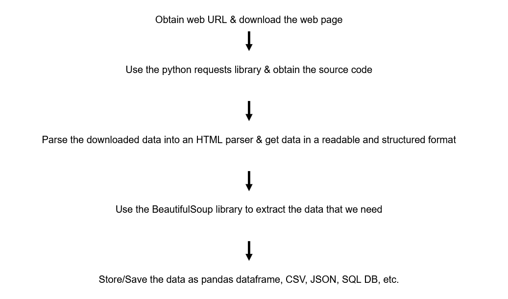

# WebScraping

> Projects related to web scraping and web crawling

## What is Web Scraping?

The process of web scraping involves fetching or downloading a web page, extracting data from it, and saving it to a DB or spreadsheet. It is an automated process of retrieving structured data from a website. 

## Why Web Scraping?

Consider that you need to collect data from a website. There are three different ways to collect Structured Data from a website.

1. Download .csv file from a website

You can download the .csv extension file from a website but not in all cases this file is available. In most of the cases, attachments/downloads aren't available.

2. Copy and Paste to a CSV or Excel File

This is the simplest step you can do but it is meant for hard-working people and not smart working. It is time-consuming and complex when there are multiple records to look at. When it comes to multiple web pages or multiple web sites then the task gets tedious and also impossible in some use cases by this technique.

3. API (Application Programming Interface)

APIs are comparatively simpler and a better choice than the rest of the two but it is charged and is costly. Also, it does not provide relevant data in the preferred structure. It also takes time to request data using an API.

#### To overcome the above shortcomings, we can replace these traditional methods with web scraping. 

## Usage of Web Scraping - Examples

#### Web-scraping is used in several domains. Let us understand the web scraping use cases in a much better way by looking at the following examples -

* Price Comparison Engines

Get prices of an item from different websites and present them in a structured manner for comparisons.

* News Aggregation

Aggregating top news articles from multiple websites to one site.

* Sentiment Analysis

Collect tweets or hashtags to analyze people's sentiments on particular issues such as politics or products.

* Hotel Industry

Scraping hotel prices and images and comparing them for a better choice for customers or target audience. 

## What is BeautifulSoup Library?

1. BeautifulSoup transforms HTML text/script into a tree format for easy readability.
2. This will make it easy to search for what we want inside the HTML/CSS contents.
3. You can search for classes, headers, tables, paragraphs, etc which are presented in a readable structure by BeautifulSoup.
4. BeautifulSoup will help with isolating the titles, tags, and links from the HTML documents so that we can extract the content that we want (text/image).

## Web Scrapping Process

## Python Web Scraping Examples

1. [Web scraping for Premier League Table 2019-20](premier-league-table.md)
